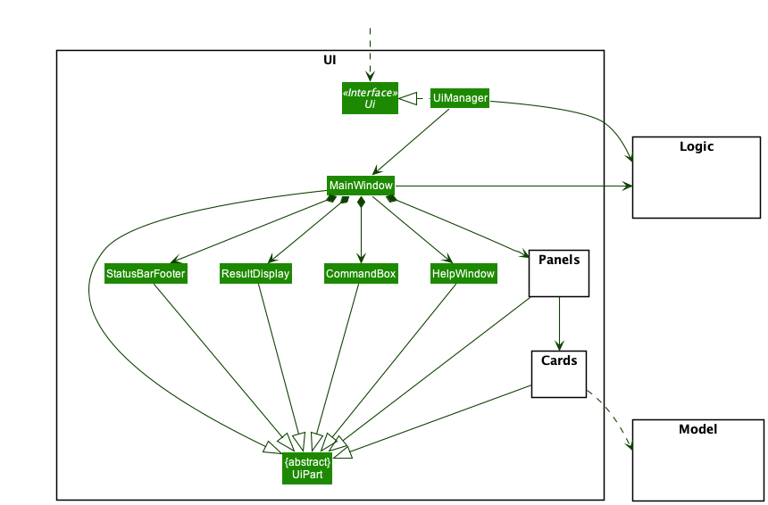
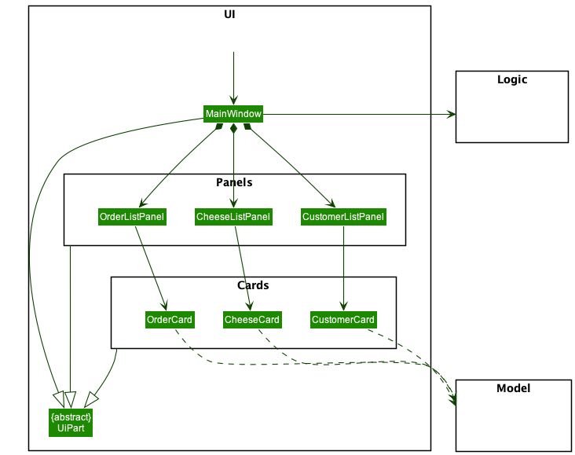

* Table of Contents
{:toc}

--------------------------------------------------------------------------------------------------------------------

## **Setting up, getting started**

Refer to the guide [_Setting up and getting started_](SettingUp.md).

--------------------------------------------------------------------------------------------------------------------

## **Design** [In Progress]

### Architecture

### UI component

**API**: `Ui.java`

The UI consists of a `MainWindow` that is made up of parts e.g.`CommandBox`, `ResultDisplay`, `StatusBarFooter` etc. 
All these, including the `MainWindow`, inherit from the abstract `UiPart` class.

The `UI` component uses the JavaFx UI framework. The layout of these UI parts are defined in matching `.fxml` files 
that are in the `src/main/resources/view` folder. For example, the layout of the `MainWindow` is specified in 
`MainWindow.fxml`.

The `UI` component:
* Executes users' commands using the `Logic` component.
* Listens for changes to `Model` data so that the UI can be updated with the modified data. 
* Any changes in `Model` data, i.e. customers, cheeses or orders data, are reflected through the `Panels` and `Cards`
  sub-components.
  
The class diagram below shows in more detail the compositions of the `Panels` and `Cards` components as well as their 
relationships with other classes.

### Logic component

### Model component

### Storage component

### Common classes

--------------------------------------------------------------------------------------------------------------------

## **Implementation** [In Progress]

--------------------------------------------------------------------------------------------------------------------

## **Documentation, logging, testing, configuration, dev-ops** [In Progress]

--------------------------------------------------------------------------------------------------------------------

## **Appendix: Requirements**

### Product scope

**Target user profile**:
* Freelance cheesemaker
* Runs home-based business
* Prefers desktop apps over other types
* Can type fast

**Value proposition**:
1. Specific properties of each cheese
2. Track order status of each cheese (either by batches or individually)

### User stories

Priorities: High (must have) - `* * *`, Medium (nice to have) - `* *`, Low (unlikely to have) - `*`

| Priority | As a …​                      | I want to …​                     | So that I can …​                                                        |
| -------- | ----------------------------| ------------------------------- | ---------------------------------------------------------------------- |
| `* * *`  | New user                    | Input a new order |  |
| `* * *`  | New user                    | Delete an existing order |  |
| `* * *`  | New user                    | Add cheese entries |  |
| `* * *`  | New user                    | Mark a sample order as delivered |  |
| `* * *`  | New user                    | Search for a customer | Find the customer’s contact information |
| `* *`    | New user                    | Save the data input | Retrieve the same information later |
| `* *`    | User with some familiarity  | View a summary of my inventory | See if there is a need to increase production |
| `* *`    | User                        | See the introduction message |  |
| `*`      | User with some familiarity  | Search up orders of a specific customer | Efficiently find the order status |

[More to be added]

### Use cases

(For all use cases below, the **System** is the `CHIM` and the **Actor** is the `user`, unless specified otherwise)

#### Use case: Input a new order

**MSS**

1. User adds an order by specifying the cheese type and quantity of the order, and the phone number of the customer, with optional field order date.
2. CHIM creates the order and shows the details of the new order.

   Use case ends.

**Extensions**
1a. The given cheese quantity is invalid.
  * 1a1. CHIM shows an error message.

    Use case resumes at step 1.

1b. The customer with the given phone number cannot be found.
  * 1b1. CHIM shows an error message.

    Use case resumes at step 1.

#### Use case: Input a cheese

**MSS**

1. User adds a cheese to the inventory by specifying its type and quantity.
2. CHIM shows a confirmation message that the cheese has been added.

   Use case ends.

**Extensions**
1a. The given cheese quantity is invalid.
  * 1a1. CHIM shows an error message.

    Use case reumes at step 1.

#### Use case: Input a Customer

**MSS**

1. User adds a customer by specifying name, phone number and address.
2. CHIM creates the new customer and shows details of the new customer.

   Use case ends.

**Extensions**
* 1a. The given phone number is invalid.
  * 1a1. CHIM displays an error message.

    Use case resumes at step 1.

* 1b. The given phone number is a duplicated customer.
  * 1b1. CHIM displays an error message.

    Use case resumes at step 1.

#### Use case: Edit an Order

**MSS**

1. User enters an order number to edit with at least 1 field: cheese type, quantity, phone number and order date.
2. CHIM edits the order and shows details of the new order.

   Use case ends.

**Extensions**
* 1a. The supplied fields are all the same.
  * 1a1. CHIM displays an error message.

    Use case resumes at step 1.

* 1b. The order is marked as completed.
  * 1b1. CHIM shows an error message.

    Use case resumes at step 1.

* 1c. The given cheese quantity is invalid.
  * 1c1. CHIM shows an error message.

    Use case resumes at step 1.

* 1d. The customer with the given phone number cannot be found.
  * 1d1. CHIM shows an error message.

    Use case resumes at step 1.

#### Use case: Edit an Cheese

**MSS**

1. User enters a cheese number to edit with at least 1 field: cheese type, manufacture date, maturity date and expiry date.
2. CHIM edits the cheese and shows details of the new cheese.

   Use case ends.

**Extensions**
* 1a. The supplied fields are all the same.
  * 1a1. CHIM displays an error message.

    Use case resumes at step 1.

* 1b. The given cheese is marked as assigned.
  * 1b1. CHIM shows an error message.

    Use case resumes at step 1.

#### Use case: Edit a Customer

**MSS**

1. User enters a customer number to edit with at least 1 field: name, phone number, email and address.
2. CHIM edits the customer and shows details of the new customer.

   Use case ends.

**Extensions**
* 1a. The supplied fields are all the same.
  * 1a1. CHIM displays an error message.

    Use case resumes at step 1.

* 1b. The given phone number is invalid.
  * 1b1. CHIM displays an error message.

    Use case resumes at step 1.

* 1c. The given phone number is a duplicated customer.
  * 1c1. CHIM displays an error message.

    Use case resumes at step 1.

#### Use case: Delete an Order

**MSS**

1. User enters an order number to delete.
2. CHIM deletes the order from the list of orders.

   Use case ends.

**Extensions**
* 1a. No such order with the specified order number exists.
  * 1a1. CHIM displays an error message.

    Use case resumes at step 1.

#### Use case: Delete a cheese

**MSS**

1. User enters the index of cheese to be deleted.
2. CHIM deletes the cheese from the list of cheese.

   Use case ends.

**Extensions**
* 1a. The list is empty.
    * 1a1. CHIM responds that there are no existing customers.

        Use case ends.
* 1b. No such cheese with the specified cheese number.
    * 1b1. CHIM shows an error message.

        Use case resumes at step 1.

#### Use case: Delete a customer

**MSS**

1. User enters the index of the customer to be deleted.
2. CHIM deletes the customer.

   Use case ends.

**Extensions**
* 1a. The list is empty.
    * 1a1. CHIM responds that there are no existing customers.

        Use case ends.
* 1b. The given index is invalid.
    * 1b1. CHIM shows an error message.

        Use case resumes at step 1.

#### Use case: List orders

**MSS**

1. User enters the command to list all the orders recorded in CHIM.
2. CHIM displays a list with the customers’ summary details.

   Use case ends.

**Extensions**
* 1a. CHIM does not have any orders added.
  * 1a1. CHIM informs the user that there are no orders recorded in the application.

    Use case resumes at step 1.

#### Use case: List cheeses

**MSS**

1. User enters the command to list all the cheeses recorded in CHIM.
2. CHIM displays all the cheeses in CHIM.

   Use case ends.

**Extensions**
* 1a. CHIM does not have any cheese added.
  * 1a1. CHIM informs the user that there is no cheese recorded in the application.

    Use case resumes at step 1.

* 1b. User provides an optional parameter, CHEESE_TYPE.
  * 1b1. User enters a valid CHEESE_TYPE.
    * 1b1a1. CHIM displays the current inventory count for the specific cheese_TYPE.

      Use case resumes at step 1.

  * 1b1. User enters a invalid CHEESE_TYPE.
    * 1b1b1. CHIM displays an error message.

      Use case resumes at step 1.

#### Use case: List customers

**MSS**

1. User enters the command to list all the customers recorded in CHIM.
1. CHIM displays a list with the customers’ summary details.

   Use case ends.

**Extensions**
* 1a. CHIM does not have any customers added.
  * 1a1. CHIM informs the user that there are no customers recorded in the application.

    Use case resumes at step 1.

#### Use case: Marks order as complete

**MSS**
1. User enters the index of the order to be marked as complete.
1. CHIM assigns avaliable cheeses to the order and marks the order as complete.

   Use case ends.

**Extensions**
* 1a. User provides an index which does not exist.
  * 1a1. CHIM displays an error message.
    
    Use case resumes at step 1.
    
* 1b. User provides an index in which order is already completed.
  * 1b1. CHIM responds that the order is already completed.

    Use case resumes at step 1.
    
* 1c. User provides an index of an order that cannot be completed due to lack of cheeses in inventory.
  * 1c1. CHIM responds that there are insufficient cheeses to complete the order.

    Use case resumes at step 1.

#### Use case: Search for a customer

**MSS**
1. User enters a request to search for a customer by a particular name.
1. CHIM shows the customer’s details.

   Use case ends.

**Extensions**
* 1a. More than one customer has the input name.
  * 1a1. CHIM shows a list of customers with the matching name.

    Use case ends.
* 1b. There are no existing customers with the input name.
  * 1b1. CHIM responds that there are no existing customers with the input name.

    Use case resumes at step 1.

#### Use case: Search for particular cheeses

**MSS**
1. User enters a request to search for cheeses matching certain cheese types or assignment status.
2. CHIM shows the matching cheeses.

   Use case ends.

***Extensions**
* 1a. No cheeses match the input given by the user.
  * 1a1. CHIM shows an empty list.

   Use case ends.

* 1b. User input is invalid.
  * 1b1. CHIM shows an error message.

   Use case ends.

#### Use case: Search for particular orders

**MSS**
1. User enters a request to search for orders matching certain cheese types, customer names, phone number or completion status.
2. CHIM shows the matching orders.

   Use case ends.

***Extensions**
* 1a. No orders match the input given by the user.
    * 1a1. CHIM shows an empty list.

  Use case ends.

* 1b. User input is invalid.
    * 1b1. CHIM shows an error message.

  Use case ends.

#### Use case: Exit the application

**MSS**
1. User enters the command to exit the application.
2. CHIM saves customers, orders and cheese data into data files.

   Use case ends.

### Non-Functional Requirements

### Glossary

* **Mainstream OS**: Windows, Linux, Unix, OS-X

--------------------------------------------------------------------------------------------------------------------

## **Appendix: Instructions for manual testing**

### Launch and shutdown

